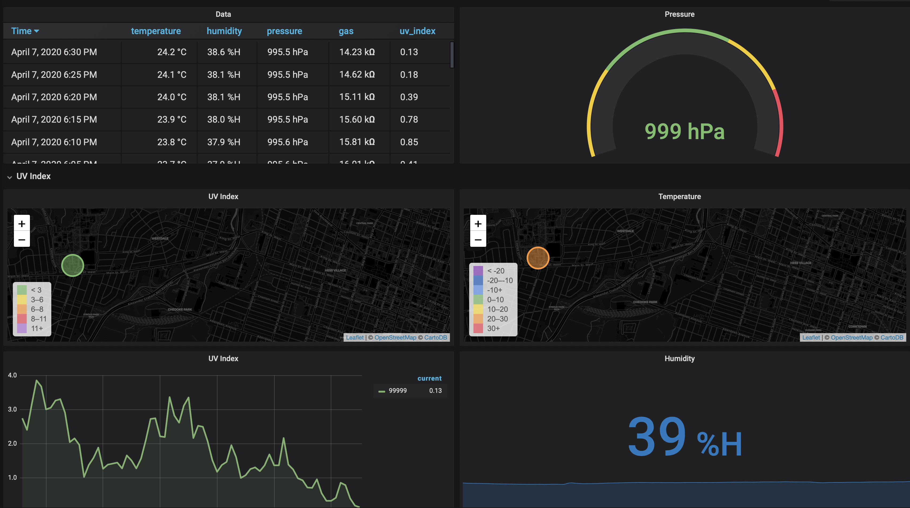

# climate-pi

climate-pi is an open-source project allowing users to host a Grafana webpage for displaying data collected by Raspberry Pi IoT nodes.

## Example



## Dependencies

This project has two branches, the server and the node. The server requires:

* Apache2
* MariaDB
* PHP7
* Grafana

The Raspberry Pi does not have an dependencies as everything needed is included in the repository.

## Installation

The Raspberry Pi does not need to be explicitly installed.
The server can be initialized by running the script [server_install.sh](https://github.com/Beasley-Neighbourhood-Association/climate-pi/blob/master/server_install.sh) from the main project directory.

```bash
./server_install.sh
```

This will initialize the LAMP server. You will need to enter your password for the root user of the MySQL database.

This project includes a default Grafana dashbord, but you are able to edit/create more to your liking using the admin account.

## Usage

Once the [server_install.sh](https://github.com/Beasley-Neighbourhood-Association/climate-pi/blob/master/server_install.sh) file is executed, the server should be up and running.

Running the program on the Raspberry Pi is as simple as running the main.py file.

```bash
cd rpi/
python3 ./main.py
```

The default time set for data transmission is every 5 minutes.

If any problems are encountered while transmitting data, a red LED will light up on the specified GPIO pin.

## Hardware

For assembly, follow the schematic below. Design requires 2x 2K resistor + 2x 3K resistor.


## Timeline


## Contributing

Pull requests are welcome. For major changes, please open an issue first to discuss what you would like to change.

Please make sure to update tests as appropriate.

## License

[GPL-3.0](https://www.gnu.org/licenses/)
